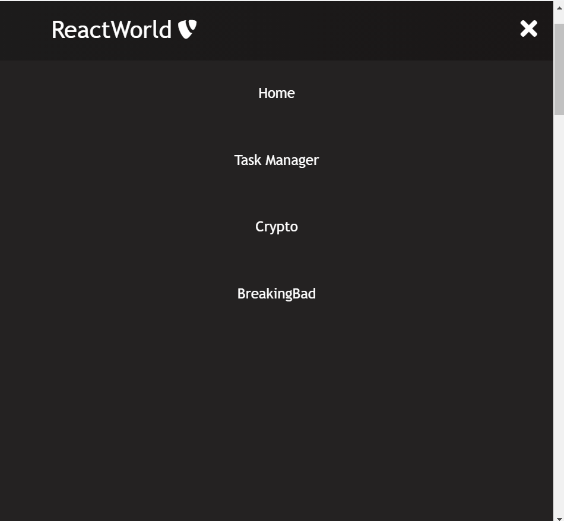

# This is an ReactWorld App that allows you get mixed experience of various applications .

### This is a ReactJS based web application

To get started and run the app:

- Clone the project.
- Run `npm install` to install the corresponding node packages
- Run `npm start` to run the app on [http://localhost:3000](http://localhost:3000)

Features Of the application:

- The app has a responsive navigation bar that allows user to navigate back and forth the website with ease
- Seperate React Components for all the important features (eg button, footer, navbar etc) .
- A beautiful To-Do List to make daily notes.
- Delete and edit your notes with ease .
- A crypto currency application to keep yourself updated with the latest currencies .
- Use of green and red symbols to showcase how a currency is behaving on a given time
- Real time updates using the [Coingecko Api](https://www.coingecko.com/en/api)

- The app also showcases one of the famous shows of our time **Breaking Bad**
- Here we can see all the famous characters of the show , with a special hovering effect on each item when we pass over it , to make the experience amazing
- All the data was fetched using the [Breaking Bad Api](https://breakingbadapi.com/)

Snapshots of the project 👇

